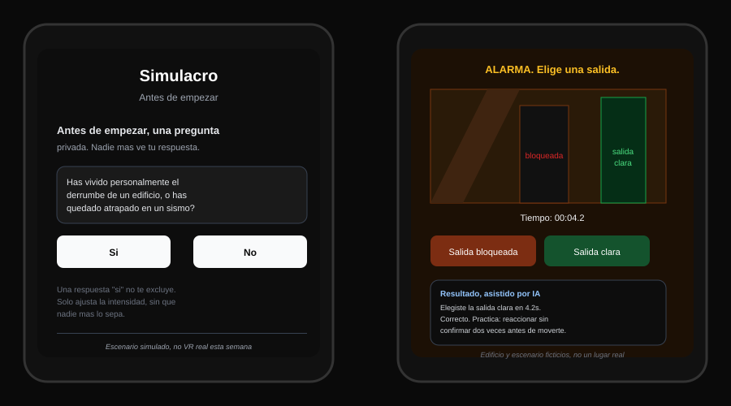
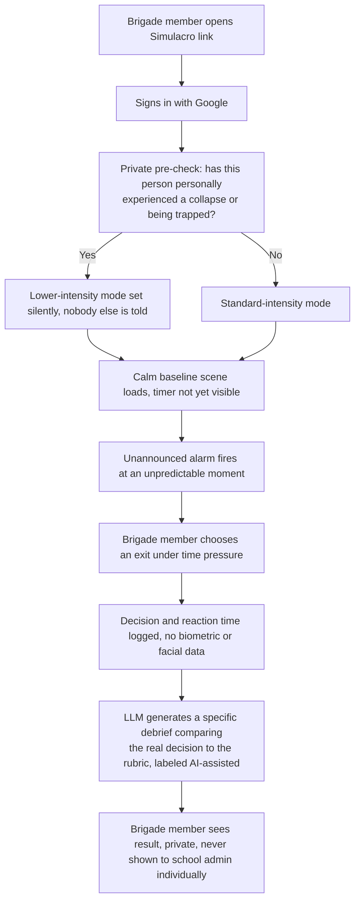
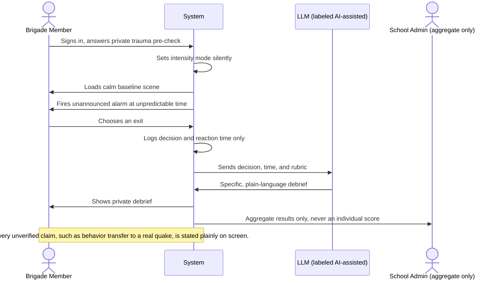

# PACKET, Simulacro (Week 6, Business Bending)
### Emilio Gomez Gonzalez, Operator, Standardized Brigade Scenario Library, Team 2
### Chapter 5, My Haunting Idol

## Problem, in my own words

Mexico runs the largest earthquake drill culture on Earth, 8.1 million people in Mexico City alone for the September 2025 exercise, 29,389 schools nationally, and it is still mostly the same rote action every time, announced in advance, one hallway walk, one alarm everybody expects. Our team's Blueprint agreed on this independently across four different lenses, and then went further and checked it: the drop in earthquake deaths from 1985 to 2017 is credited mainly to building codes revised after 1985, not to drills. Nobody, including this build, gets to claim rehearsal already saves lives. That is the honest starting line.

What survives, after a real fight with the model over my own opening pitch, is narrower than what I first proposed. I originally wanted to sell fear to the person legally responsible for a school's civil protection file. That person has no budget, the existing CDMX brigade training standard pays for hours attended, not verified performance, and no Mexican insurer ties premiums to drill quality. So the actual gap is not compliance, it is measurement: nobody has ever tested whether a rehearsal changes what a person actually does when an exit is blocked and a decision has to happen in seconds, not minutes.

Simulacro is a small, honest piece of that gap. It does not claim to be a certified drill, it does not claim VR training transfers to real survival, and it never rebuilds a real tragedy. It gives one specific, legally defined group, a school's brigade, staff and older students already responsible for leading an evacuation, one realistic, unannounced scenario, and it measures what they actually do.

## Exact user

**Profesor Raul, 34** teaches middle school and is one of twelve people named on his school's brigade roster, the legally required list of staff trained to lead an evacuation. His school sits in a soft-soil zone in Ciudad de Mexico, the same kind of ground that did the worst damage in 1985. He has never personally lived through a serious collapse. He has sat through the same 3-hour civil protection course every year, memorized the same hallway walk, and has never once been tested on what he would actually do if the usual exit were blocked and the alarm went off without warning. Nobody has ever asked him to prove he would make the right call under pressure, only that he showed up.

## Success definition

Before this module closes: a brigade member can sign in, answer one private question about prior earthquake trauma, go through one unannounced, timed decision scenario in the browser, no VR headset required, and receive a short, specific, AI-assisted debrief comparing what they actually chose against the rubric, not a generic score. Every report of what is proven versus unproven is labeled honestly on screen. One full loop, pre-check, scenario, decision, debrief, working end to end on the live URL.

## Mockup

No AI image-generation tool is available in this build session, so this is a hand-built mockup of the two screens that make the mechanism visible: the private trauma pre-check screen, and the scenario-plus-debrief screen showing the unannounced alarm, the timed decision, and the AI-assisted result.

## The world's best attempt (benchmark)

The best existing solutions on Earth for this are enterprise VR training programs already checked and cited in our team's Blueprint: Strivr, running on roughly 17,000 headsets across Walmart's US stores, with a measured knowledge gain, and Oxford Medical Simulation, selling standardized clinical scenarios to hospitals on off-the-shelf headsets. Both got the same thing right: one reusable, standardized scenario, sold and resold, not rebuilt per building. Simulacro localizes that model by substituting Mexico's own soft-soil collapse physics and its own legally defined brigade role for the enterprise buyers those products already have, and by being honest, on screen, that this is knowledge-and-decision measurement, not proof of survival, exactly the same honesty limit our own Blueprint held every global benchmark to.

## The long view (3 years)

If this slice works, Simulacro becomes the standardized scenario library our Blueprint actually bet on: three to five core situations, tuned to Mexico City's soft-soil collapse patterns, sold and resold across many schools instead of rebuilt per building, funded through its first proof phase by an institutional partner such as CENAPRED rather than by any single school. In three years, the measured, aggregated results from real brigade sessions become exactly the evidence nobody currently has to bring to CENAPRED and argue that a standard like this belongs inside the Programa Interno de Proteccion Civil itself, closing the certification gap our whole team found and could not close this week.

## Scope cut, what I am NOT building this week

- No real VR headset hardware is used or tested. The scenario runs as a real, interactive 3D scene in the browser, built to the WebXR standard so it could load on a headset later, but not verified on physical hardware this week, labeled honestly as a browser-based simulation.
- No real school building is scanned or reproduced. The corridor, the blocked exit, and the building itself are original, fictional constructions, per the Blueprint's own shadow clause, condition 1.
- No real CENAPRED, Swiss Re Foundation, or UNAM funding is secured this week. The app shows a simulated, clearly labeled funding-partner status, not a real signed agreement.
- No biometric, facial, or emotional capture of any kind, per condition 3. Only the decision made and the time it took are logged.
- Only one scenario this week, a blocked-corridor evacuation decision, not the full three-to-five scenario library the Blueprint describes as the eventual product.
- No multi-school rollout. One simulated soft-soil school context this week, matching the Blueprint's own lead test population.
- No diagnosis, medical triage, or symptom checking of any kind, forbidden zone either way.

## Flow, flowchart

## Flow, actors (swimlane)

## Architecture and stack

| Layer | Choice | Why |
|---|---|---|
| Frontend | Next.js App Router | Same proven base as amparo, comprobante, escudo, cuaderno |
| Simulation, 3D | Three.js, WebXR-compatible scene | Real, working interactive simulation, honestly labeled as browser-based, not a tested VR-headset experience |
| Styling, UI | Tailwind + shadcn/ui, new-york style | Fast, consistent, matches existing scaffold |
| Auth | Supabase Auth, Google OAuth | Security floor requirement, no password storage |
| Database | Supabase Postgres, RLS on every table | A brigade member sees only their own sessions |
| Core tables | `scenario_sessions`, `scenario_definitions` (seeded, geodata-tagged) | Matches the flow above directly |
| AI, adaptive logic | LLM call that turns a logged decision and time into a specific, plain-language debrief against a fixed rubric | Labeled AI-assisted, the AI never decides whether someone passed or failed, only explains what happened |
| Signal, geodata | Each scenario is tagged to a real Mexico City soft-soil colonia (Roma, Condesa, Doctores) | Grounds the simulation physics in the same real ground the Blueprint's evidence is about |
| Hosting | Vercel | Free tier, same as prior weeks |

## Test plan

**Mechanical pass:** create one brigade-member account, complete the private pre-check, confirm the alarm fires at an unpredictable point rather than always at the same moment, confirm a decision and its reaction time are logged correctly, confirm the AI debrief references the actual decision made rather than a generic message, confirm RLS blocks that account from seeing any other brigade member's session, and confirm the lower-intensity path is genuinely different from the standard path. Find at least one real bug in this loop, fix it, redeploy.

**Persona test (Layer 1):** a fresh chat playing Profesor Raul, walked screenshot by screenshot through the pre-check, the scenario, and the debrief. Log every point of hesitation or confusion, fix the worst one before the deadline.
